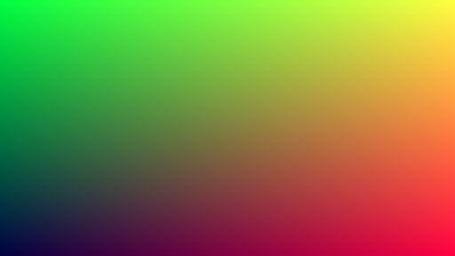
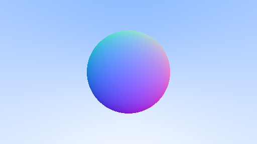
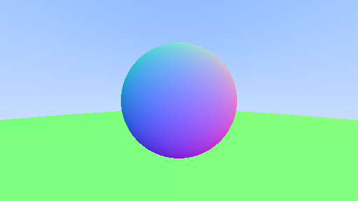
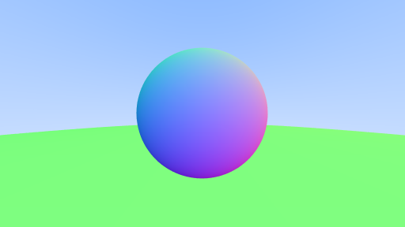
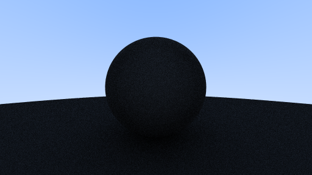
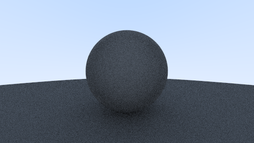
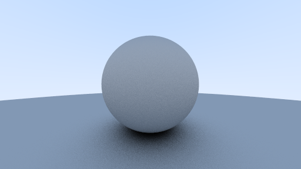
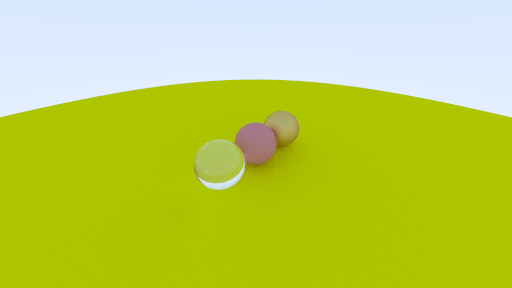
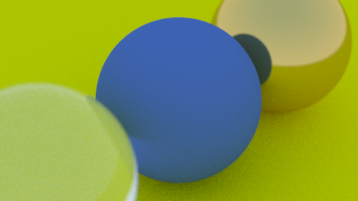
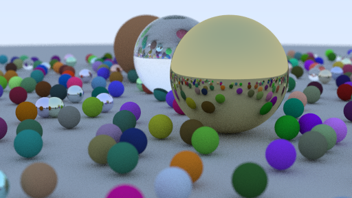

# Raytrace

Working through [Ray Tracing in One Weekend](https://raytracing.github.io/books/RayTracingInOneWeekend.html) in Rust.

## Final Render

## Progress Shots

Initial colors when writing to an image file programmatically.

Background gradient based on ray y-component.

Hit sphere filled with solid color. The first raytracing.

Hit sphere colored by unit normal direction at point of intersection.

Scene contains list of multiple hittable objects.

Antialiasing via randomized sub-pixel ray positions and multi-sampling.

Initial ray bouncing from diffuse materials.

Gamma correction.

Handle "shadow acne" with self-intersection prevention.

Multiple materials: Lambertians and shiny metal.

Semi-reflective metal surfaces via fuzz factor.

Dielectric materials (glass) with Schlick approximation of reflection angle.

Wide-angle camera.

Camera positioning and field-of-view exploration.

Camera depth of field.

Random scene generation.

